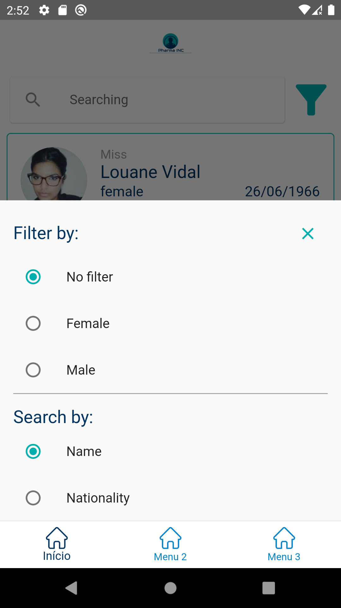

# flutter_mobile_challenge_2021

<h4 align="center"> 
	 A Flutter project challenge by coodesh
</h4>

---

<h1 align="center">
    
</h1>

<h1 align="center">
   💊 <a href="#"> Pharma Inc </a>
</h1>

  

  
  
  

<h4 align="center"> 
	 Status: Finished
</h4>

 <a href="#about">About</a> •
 <a href="#features">Features</a> •
 <a href="#layout">Layout</a> • 
 <a href="#pre-requisites">Pre Requisites</a> • 
 <a href="#tech-stack">Tech Stack</a> • 
 <a href="#author">Author</a>

## About

💊 Pharma Inc - makes it possible to find the patients and see the details of each one. Project developed during **Challenge by Coodesh** offered by Coodesh.

---

## Features

- [x] Find patients
- [x] Filter patients by gender
- [x] Search patients by name or nationality
- [x] See details of each patient
- [x] Call patient
- [x] Go to the patient's location

---

## Layout

  

  

  

---

## Pre-requisites

Before you begin, you will need to have the following tools installed on your machine:
[Git] (https://git-scm.com), it is good to have an editor to work with the code like [VSCode] (https://code.visualstudio.com/)

#### Running the mobile application

- Clone this project
- Run **"flutter packages pub run build_runner build --delete-conflicting-outputs"** to generate mobx .g files

---

## Tech Stack

The following tools were used in the construction of the project:

-   **Flutter 1.22.5**
-   **Dart 2.10.4**
-   **Visual Studio Code 1.54.3**
-   **Slidy**
-   **Tests with Mockito 4.1.3**
-   **Clean architecture**
-   **Dependency injection with Modular**
-   **State management with Mobx**
-   **Shimmer for screen loading**
-   **Dio for communication with Api**
-   **Url launcher to phone call**
-   **Map launcher to share to maps**
---
## Author

  
 <b>Heverson Ataide</b></a>
  

 

---

Made with love by Heverson Ataide 👋🏽 [Get in Touch!](https://www.linkedin.com/in/heverson-ataide-a7b71b148/)
